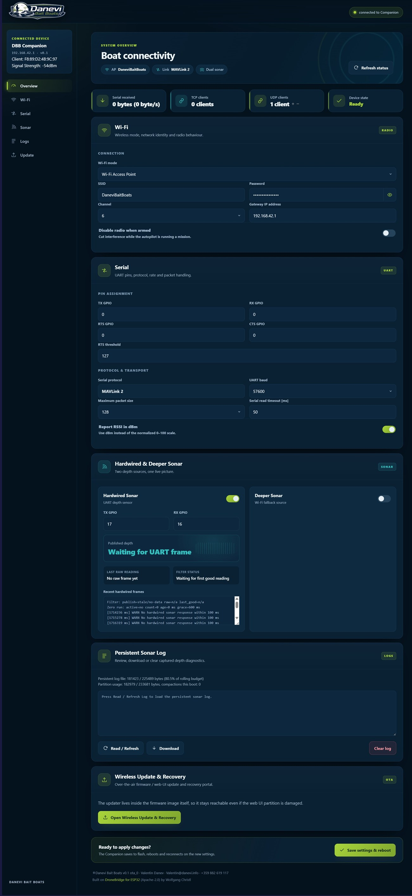

# DBB Companion

**DBB Companion** is the open-source onboard-computer firmware for the **Danevi Bait Boats** platform — an ESP32-S3 companion computer that bridges dual sonar and a MAVLink flight controller (ArduPilot / ArduRover) over Wi-Fi, with a built-in web dashboard and dual-slot OTA updates.

> ⚠️ **Early / work-in-progress.** This is the open *base*. It already works as a sonar + MAVLink Wi-Fi bridge, but hardening (RAM/task cleanup) is ongoing — expect changes.



## Why?

Fishing sonars — a hardwired transducer, or a **Deeper CHIRP+** over Wi-Fi — only talk over **short-range Wi-Fi**. On a bait boat that's the core problem: a few hundred metres out and the sonar's Wi-Fi is gone, exactly where you want to read the depth.

DBB Companion moves that link **onto the boat**. The ESP32 sits right next to the sonar — its Wi-Fi only has to reach *centimetres*, not kilometres — reads the depth from a **hardwired** sonar and/or the **Deeper's own Wi-Fi**, and republishes it as a MAVLink `DISTANCE_SENSOR` to the flight controller. From there the depth rides your **long-range radio telemetry link** — e.g. ELRS carrying MAVLink, km-class range — straight back to the tablet/laptop ground station, right alongside GPS, battery and the rest of the boat's telemetry.

**The result: no long-range Wi-Fi to the sonar.** Depth travels the same km-range radio link as everything else, so you read it on your GCS wherever the boat is — no separate Wi-Fi bridge back to shore, no losing the sonar the moment the boat gets far out.

## What it does
- **Dual sonar → MAVLink `DISTANCE_SENSOR`** — a hardwired UART sonar *and* a Deeper CHIRP+ Wi-Fi sonar (boot-time source selection), published to the flight controller.
- **MAVLink 2 Wi-Fi bridge** to an ArduPilot / ArduRover flight controller (plus a transparent passthrough mode).
- **Web dashboard** (AP or STA) — settings, live stats, sonar debug, logs.
- **Dual-slot A/B OTA** with a baked-in recovery portal, plus a `factory` fallback image the bootloader reverts to if both slots fail. On the S3 target the web UI is embedded in the app, so firmware and UI update atomically.
- **Separated on-device logs** — bounded system events plus per-capture-session trip/energy,
  hardwired-sonar and Deeper-sonar files (armed or timed manual capture), browsable and
  downloadable per stream from the web UI; whole-session retention that never touches the
  FC firmware reserve.
- **Flight-controller firmware updates over USB OTG** — upload an ArduPilot `.apj` through the web
  UI and the companion reflashes the FC itself, no PC and no opening the hull. Measured
  111 KB/s.

## Hardware
- **ESP32-S3-WROOM-1 (N16R8)**.
- A flight controller running **ArduPilot / ArduRover** with MAVLink 2 on a spare UART.
- Optional: a USB-C to USB-C cable from the S3's native USB port to the flight controller, for
  firmware updates. Nothing else. Both boards must be independently powered; do not bridge the
  companion board's USB-OTG VBUS pads and do not put a USB hub in this link.
- Optional: a hardwired UART sonar and/or a Deeper CHIRP+.

## Build (ESP-IDF v5.4.x)
```sh
idf.py set-target esp32s3
idf.py build
idf.py -p <PORT> flash monitor
```
The small web UI under `frontend/` is built automatically during the CMake build by
`tools/build_frontend.py`, using the Python that ESP-IDF pins. There is no npm
dependency.

`sdkconfig.defaults.esp32s3` selects the 16 MiB N16R8 layout in
`partitions_s3_16mb.csv`, octal PSRAM, embedded web assets and FAT logs. That
layout reserves a `factory` partition for a known-good image, which the
bootloader falls back to if both OTA slots become unbootable.

## Architecture: open base + optional brain
This repository is the **open base**. It exposes a small hook interface (`main/dbb_brain.h`) backed by **weak no-op stubs** (`main/dbb_brain_stub.c`). Out of the box those hooks do nothing, so you get a plain, fully-working sonar + MAVLink bridge.

An optional **brain** component can override those hooks at link time to add autonomous behaviour. If a sibling folder `../dbb-brain-private/components/` is present at build time, its *strong* symbols replace the weak stubs (see the top-level `CMakeLists.txt`). Anyone can write their own brain against the same interface.

## Credits & license
- This firmware is **Apache-2.0** — see [`LICENSE`](LICENSE) and [`NOTICE`](NOTICE).
- Built on **[DroneBridge for ESP32](https://github.com/DroneBridge/ESP32)** (Apache-2.0) by Wolfgang Christl — the Wi-Fi transport, parameter/settings system, serial↔MAVLink bridge, and REST scaffolding.
- MAVLink via **[fastMAVLink](https://github.com/olliw42/fastmavlink)** (MIT).
- The dual-sonar stack, persistent log, A/B OTA, and web dashboard are original work by **Valentin Danev & Optimus Prime** .

---
*Danevi Bait Boats · DBB Companion*     
